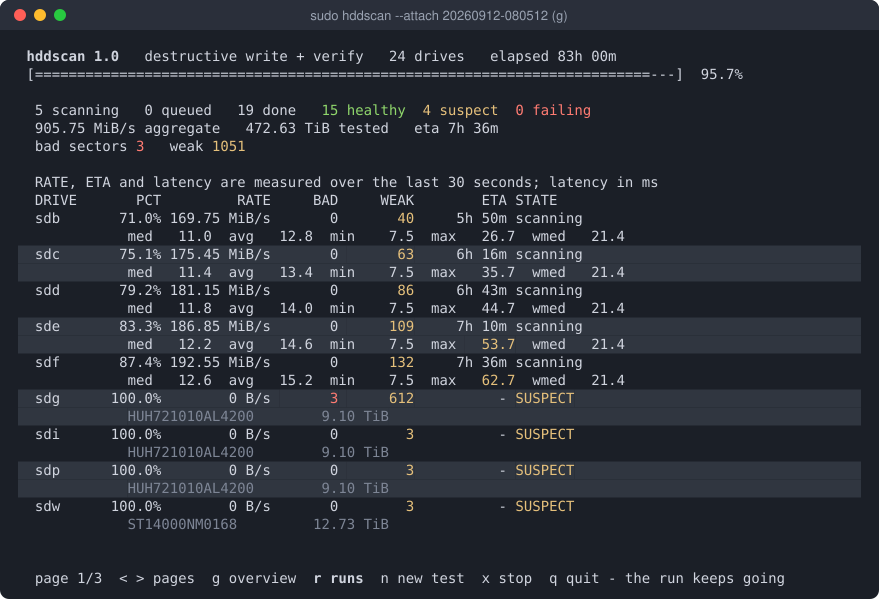
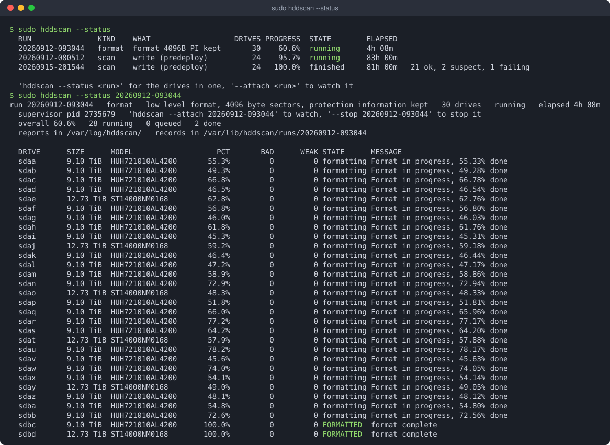

# hddscan

Finds sectors on a rotating disk that return data **too slowly**, not just ones
that fail outright.

That is the failure SMART misses. A drive can read every sector successfully
and still be dying, because the firmware is spending tens of milliseconds of
internal recovery on each one. `SMART Health Status: OK` keeps saying OK right
up until it doesn't — one drive tested with this tool reported OK with a single
reallocated sector in its life, while its own error log showed 42.9 million
reads that needed the slow recovery path, and its own long self-test had
already failed.

**Site and guide, with screenshots of every screen:**
<https://intellistream-datahub.github.io/hddscan/>

Single-file C, no dependencies beyond libc, so the binary works on a rescue
system with nothing installed. `smartctl`, `sdparm`, `hdparm` and sg3-utils are
used when present and done without when absent.

```sh
make
sudo ./hddscan            # opens the form
```

Or take a static binary for x86_64 or aarch64 from
[Releases](https://github.com/IntelliStream-DataHub/hddscan/releases): one
file, no glibc version floor, tested on its own architecture before it was
published.

```sh
tar xzf hddscan-1.0-linux-x86_64.tar.gz
sudo install hddscan-1.0-linux-x86_64/hddscan /usr/local/sbin/
sudo ln -sf hddscan /usr/local/sbin/dm-badblocks   # optional: the map tool's own name
```

## Quick start

Run it on a terminal with no arguments and it opens a picker: choose drives,
choose what you are doing, watch a live dashboard. When the scan finishes a
summary holds the verdicts on screen — `n` starts another test, `q` quits, and
on a drive the scan found damage on, `h` hides it (below). If
something is already running on the machine, it shows you that first.



Each drive gets two rows — what it is doing, then how it is behaving — and the
whole table fits an 80-column terminal. A shelf is more drives than any screen
holds, so it pages: `<` and `>`, the arrow keys, page up and page down. `g`
swaps the table for an overview that puts every drive on one line, and back.

`--check-deps` says which
optional tools are missing and prints the `dnf`/`apt` line that installs them.

The first question is the **profile**, because what a drive needs tested
depends entirely on what you are about to do with it:

| profile | mode | for |
|---|---|---|
| **predeploy** *(default)* | write | No data on it yet. Writes every sector and verifies it reads back, then leaves the drive configured for service. |
| **inservice** | read | It holds data you want to keep. Never writes anything. |
| **survey** | read, sampled | Quick triage of a shelf. |
| **decay** | check | Weeks after a predeploy run: has the pattern rotted? |
| **repair** | write | predeploy, plus forcing a reallocation of anything unreadable. |

A drive being prepared is the one moment someone is deliberately configuring
it, so predeploy (and repair) also **save** the configuration it should run
with on a SAS drive: auto-reallocation on, read cache on (`--fix-config`), and
the drive's own background scan on, weekly (`--bms on --bms-interval 168`).
Each change is printed with the command that undoes it; `--no-fix-config` and
`--bms keep` opt out. The write cache is turned off only for the run, so the
write pass times the platter rather than the drive's DRAM. None of it applies
if you override the mode — `--mode read` under predeploy saves nothing.

The default writes, because a surface test is normally run before a drive goes
into service and a read-only pass cannot tell you whether a sector will *accept*
a write. So a bare `hddscan /dev/sdb` stops and asks for `--confirm` rather than
doing anything — an error, never data loss.

## Using a damaged drive anyway

A drive with a few hundred bad sectors can still be a good backup target, as
long as we make the bad/weak sectors inaccessible. ext4 can take a list of them at `mkfs` time,
and the report prints the commands. For any other filesystem (ZFS, btrfs,
XFS), hddscan can cut the damage out one layer down instead:

```sh
sudo hddscan --profile inservice /dev/sdc            # a whole-drive scan
sudo hddscan --hide-bad --confirm sdc /dev/sdc       # -> /dev/mapper/bb-<serial>
sudo zpool create -o ashift=12 -O compression=zstd backup /dev/mapper/bb-<serial>
```

`--hide-bad` writes a map of the damage the last complete scan found onto the
drive itself, and loads it with device-mapper: no kernel module. Damage found
later is moved to spares held back for it (`hddscan dm remap`), and
`contrib/dm-badblocks.service` sets the devices up again at boot. The form
offers it as **Mode → hide bad**, and the summary a scan ends on offers it as
`h` for any drive the scan found damage on: pick the drive with ↑/↓, press `h`,
confirm with `y`. See `DESIGN.md` for how the map works.

## Runs keep going without you

A scan or a format is a **run**, and it belongs to a supervisor process of its
own rather than to the terminal that started it. Quit, close the window, lose
the ssh session: the work carries on, and every drive keeps a small text record
of where it has got to.

```sh
sudo hddscan --profile predeploy --confirm sdb --detach /dev/sd{b..z}
sudo hddscan --status                 # every run on this machine
sudo hddscan --status sdq             # the run a given drive is in
sudo hddscan --attach 20260912-110000 # open the dashboard on one
sudo hddscan --stop 20260912-110000   # stop it; partial reports are still written
```

That is what makes a shelf manageable: thirty drives in a low level format and
twenty-four more being scanned are two runs, and the dashboard swaps between
them with one keystroke. Start hddscan again on a machine with work in progress
and it shows you that work before it offers to configure any more.



Records live in `/var/lib/hddscan` as root, `~/.local/state/hddscan` otherwise,
and are plain key-and-value text — `--status-json` if a script wants them, grep
if you are in a hurry. A drive already in a live run is refused by any other
run, since two of them on one spindle would time each other's seeks.

The screenshots are from a demo store — a 24-drive write test and a 30-drive
low level format running side by side — not from a real shelf.

## Testing

```sh
# a drive with data on it: read-only, never writes
sudo hddscan --profile inservice /dev/sdb

# a drive going into service: writes every sector, verifies, re-reads
sudo hddscan --confirm sdb --state /var/tmp/sdb.state --resume /dev/sdb

# quick triage of a shelf, one keystroke per controller in the form
sudo hddscan --profile survey --all

# weeks later, on a drive an earlier predeploy run wrote
sudo hddscan --profile decay /dev/sdb

# give a drive its best chance: write, rewrite what is still slow,
# force a reallocation of anything unreadable, then re-read the lot
sudo hddscan --repair --confirm sdb --chunk 4M --recovery-time 300 /dev/sdb
```

A full pass over a 14 TB drive takes about a day, and `--repair` roughly twice
that. Use `--state` with `--resume` on anything that long.

Two flags matter more than they look on a drive that is already sick:

```sh
--recovery-time 300     # stop the drive grinding a second per bad sector
--retries 3             # stop the tool grinding twenty attempts per sector
```

Without them a drive with a defect band can spend days re-reading a few
thousand sectors and cover almost none of the surface. The scan now notices
that and says so, but the flags are the fix.

## Putting a damaged drive back to work

A drive with a few hundred bad sectors is not scrap. ext2/3/4 keeps a bad-block
inode, and blocks listed in it are never allocated to anything else, so a
filesystem built with that list simply steps around the damage. The end of scan
report prints the commands with the numbers already filled in; the list itself
can be built after the fact, from the scan's checkpoint or its `--csv`, once you
know the block size and partition offset the filesystem will use:

```sh
hddscan --badblocks-from /var/lib/hddscan/RUN/sdb.ckpt \
        --badblocks-list /root/sdb.bb \
        --badblocks-blocksize 4096 --badblocks-offset 1M
mkfs.ext4 -b 4096 -l /root/sdb.bb /dev/sdb1
e2fsck -l /root/sdb.bb /dev/sdb1     # add more, after a later scan
```

Only ext2/3/4 keep such a list. For anything else, `--hide-bad` cuts the damage
out one layer down (see *Using a damaged drive anyway* above). Never put the raw
drive in mdraid or a ZFS pool: both deliberately fault a drive out on a read
error rather than routing around one — the right behaviour for redundancy, the
wrong one for a drive you have decided to nurse. A drive kept this way belongs
where a second copy exists: a backup target or a scratch disk. Re-scan every few
months and add what turns up; the list only covers damage that had already
appeared when it was made.

## Low level formatting

`--format` runs a SCSI `FORMAT UNIT` on every selected drive, in parallel. It
erases the drive, runs for hours, and prints the exact `sg_format` command
before it starts. `--dry-run` prints that command and stops. A format is a run
like any other: `--detach` it, come back to it with `--status`, and watch all
thirty on one dashboard fed by what each drive reports about its own progress.

```sh
# see what it would do
sudo hddscan --format --format-pi none --confirm sdb --dry-run /dev/sdb

# strip protection information, keep the sector size
sudo hddscan --format --format-pi none --confirm sdb /dev/sdb

# change the sector size too, and ask for a fast format
sudo hddscan --format --format-blocksize 4096 --format-pi none \
             --format-fast --confirm sdb /dev/sdb
```

`--format-pi` defaults to `keep`, because `sg_format` itself defaults to
*stripping* protection information — so a bare sector size change would remove
it as a side effect nobody asked for.

Worth knowing before you reach for this:

- **Removing protection information can recover real capacity.** Type 2 PI
  stores eight bytes beside every *512-byte* block. On a 512e Seagate Exos this
  took 13,715,978,059,776 bytes to 14,000,519,643,136 — the full nominal 14 TB,
  284 GB back.
- **A PI-formatted drive refuses to read blocks that have never been written**
  since the format, with `EILSEQ`. That is the format talking, not the media,
  and hddscan counts it separately and says the blocks were not tested.
- **Not every drive offers 4096.** One tested here rejects it at the MODE
  SELECT, which costs nothing: the format never starts and the drive is
  untouched.
- **A format cannot be called back.** `FORMAT UNIT` runs inside the drive's own
  firmware, so `--stop` on a format run stops *watching* it. The drive carries
  on, and the record says so instead of implying it went back to idle.

## More

- `man 8 hddscan` — every option, exit codes, the guarantee, protection
  information.
- [DESIGN.md](DESIGN.md) — why it works this way, what was measured on real
  drives, and which paths are still unverified.
- [AGENTS.md](AGENTS.md) — the invariants, and how to change this without
  making it quietly lie about drive health.
- `make test` — about 360 tests across three suites, no root and no real
  device required.

## Licence

MIT. See [LICENSE](LICENSE). Copyright (c) 2026 Olav Gjerde.
